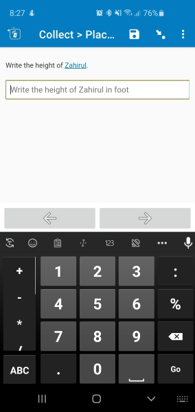

# decimal-placeholder

 

||
|:---:|
|Customized text inside placeholder of decimal type field|

## Description

Use this field plug-in to use customized text in the placeholder of decimal type field.

For this field plug-in, enter the text for the `text` parameter (see **Parameters** below), and that text will be shown into the field's placeholder. It can only be used with decimal field type.

This plug-in was developed based on the [baseline-decimal](https://github.com/surveycto/baseline-decimal/blob/master/README.md) field-plug-in, therefore, also supports the additional improvements in the [baseline-decimal](https://github.com/surveycto/baseline-decimal/blob/master/README.md) field-plug-in.

## Default SurveyCTO feature support

| Feature / Property | Support |
| --- | --- |
| Supported field type(s) | `decimal`|
| Default values | Yes |
| Constraint message | Uses default behavior |
| Required message | Uses default behavior |
| Read only | Yes *(shows the current value, if present)* |
| media:image | Yes |
| media:audio | Yes |
| media:video | Yes |
| `show-formatted` appearance | No |

## How to use

**To use this field plug-in as-is**, just download the [text-placeholder.fieldplugin.zip](decimal-placeholder.fieldplugin.zip) file from this repo, and attach it to your form.

To create your own field plug-in using this as a template, follow these steps:

1. Fork this repo
1. Make changes to the files in the `source` directory.

    * **Note:** be sure to update the `manifest.json` file as well.

1. Zip the updated contents of the `source` directory.
1. Rename the .zip file to *yourpluginname*.fieldplugin.zip (replace *yourpluginname* with the name you want to use for your field plug-in).
1. You may then attach your new .fieldplugin.zip file to your form as normal.

## Parameters

There is one parameter, `text`, which is the custom text. The following example can be used in *appearance* for a text field:

    custom-text-placeholder(text='Please write the full name')

## More resources

* **Test form**  
[extras/testform](extras/testform)
* **Developer documentation**  
Instructions and resources for developing your own field plug-ins.  
[https://github.com/surveycto/Field-plug-in-resources](https://github.com/surveycto/Field-plug-in-resources)
* **User documentation**  
How to get started using field plug-ins in your SurveyCTO form.  
[https://docs.surveycto.com/02-designing-forms/03-advanced-topics/06.using-field-plug-ins.html](https://docs.surveycto.com/02-designing-forms/03-advanced-topics/06.using-field-plug-ins.html)